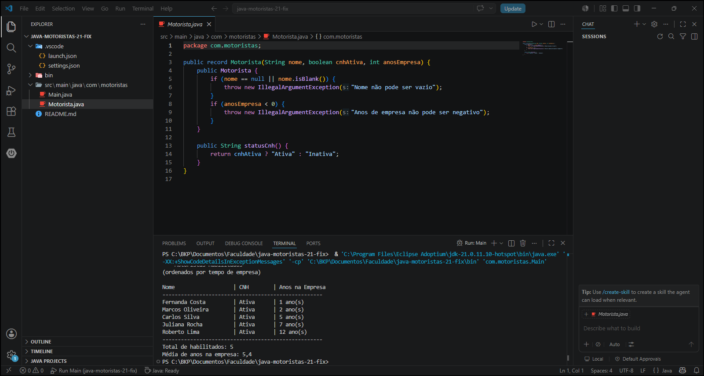

# PRODUTIVIDADE_IA

1. Código modernizado

package com.motoristas;

import java.util.Comparator;
import java.util.List;

public class Main {

    public static List<Motorista> getMotoristasDaEmpresa() {
        return List.of(
            new Motorista("Carlos Silva", true, 5),
            new Motorista("Ana Souza", false, 3),
            new Motorista("Roberto Lima", true, 12),
            new Motorista("Fernanda Costa", true, 1),
            new Motorista("Paulo Mendes", false, 8),
            new Motorista("Juliana Rocha", true, 7),
            new Motorista("Marcos Oliveira", true, 2)
        );
    }

    public static List<Motorista> filtrarHabilitados(List<Motorista> motoristas) {
        return motoristas.stream()
            .filter(Motorista::cnhAtiva)
            .sorted(Comparator.comparingInt(Motorista::anosEmpresa))
            .toList();
    }

    public static void main(String[] args) {
        var motoristas = getMotoristasDaEmpresa();
        var habilitados = filtrarHabilitados(motoristas);

        if (habilitados.isEmpty()) {
            System.out.println("Nenhum motorista com CNH ativa encontrado.");
            return;
        }

        var cabecalho = """
                === Motoristas Habilitados ===
                (ordenados por tempo de empresa)
                """;

        System.out.println(cabecalho);
        System.out.printf("%-22s | %-10s | %s%n", "Nome", "CNH", "Anos na Empresa");
        System.out.println("-".repeat(52));

        habilitados.forEach(m ->
            System.out.printf("%-22s | %-10s | %d ano(s)%n",
                m.nome(), m.statusCnh(), m.anosEmpresa())
        );

        System.out.println("-".repeat(52));
        System.out.println("Total de habilitados: %d".formatted(habilitados.size()));

        double mediaAnos = habilitados.stream()
            .mapToInt(Motorista::anosEmpresa)
            .average()
            .orElse(0.0);

        System.out.println("Média de anos na empresa: %.1f".formatted(mediaAnos));
    }
}

2. Relato do aprendizado

Com I.A auxiliando e criando prompts corretos e explicando nos detalhes a real necessidade a ia nao se perde, porem tem que ter cuidado ao pedir muitas coisa porque ela inventa algo que nao foi solicitado.

3. Prompt de desafio

Atue como um engenheiro de software sênior especializado em Java. Tenho um código legado que usa Java 7 (for-each e Comparator anônimo) e preciso modernizá-lo para Java 21, utilizando Stream API e Method References.

Reescreva o código, explique cada mudança realizada e por que a nova versão é mais segura e mais fácil de manter

4. Captura de tela

